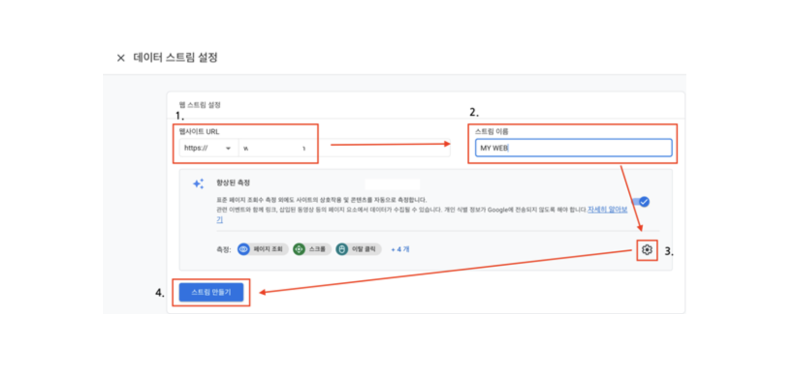
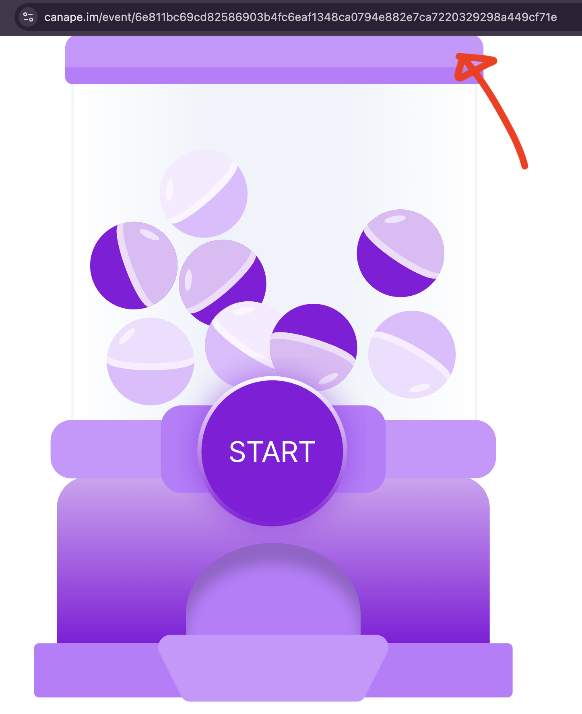
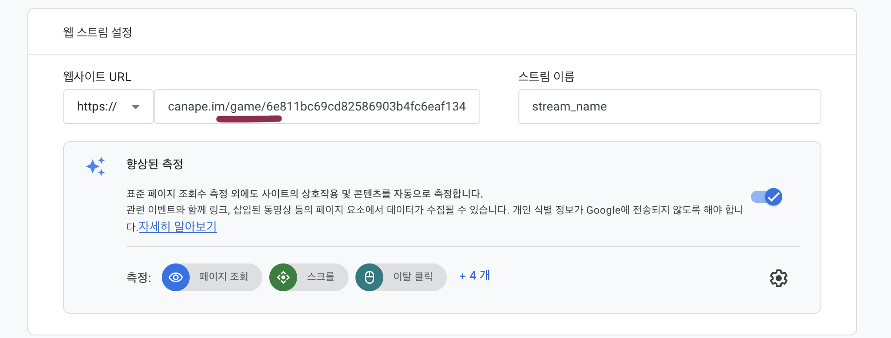
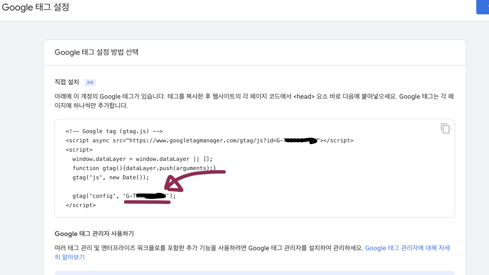
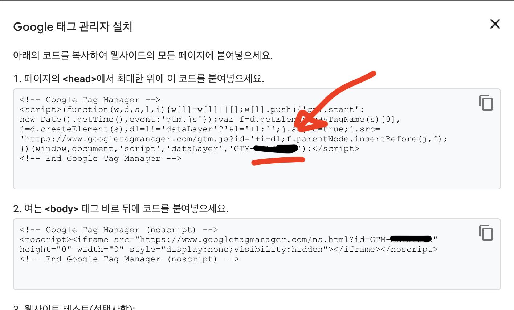
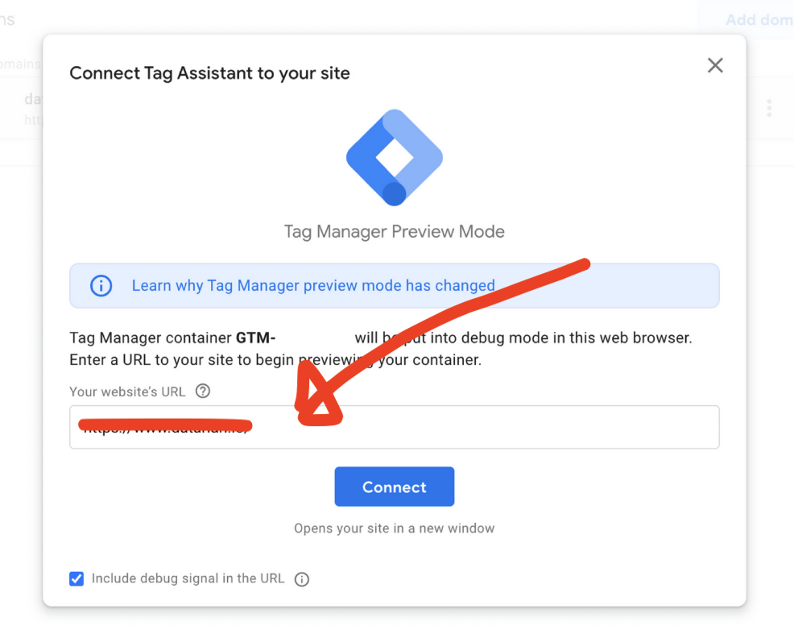

## 구글 애널리틱스 연동 전 주의사항

1. `카페24`가 아닌 `일반 이벤트`에서 적용이 가능합니다.
2. 카나페 개발팀이 배포해야지만 정상적으로 테스트가 가능합니다. ID를 제출하시고 카나페팀이 정상적으로 배포하고 연락드릴 때까지 잠시만 기다려주세요.
3. 커스텀 연동과 같이 사용 가능합니다만 커스텀 연동과 별개로 추가 요청이 필요합니다.
4. 이벤트 수정은 가능하나 새로운 이벤트를 다시 제작하여 배포하시면 해시값이 바뀌게 되어 추적이 어려울 수 있습니다.

## Step 1: 구글 애널리틱스를 생성하거나 URL을 추가해주세요.

[구글 애널리틱스 계정 생성 + 추적코드 설치 방법](https://brunch.co.kr/@mobiinside/4845)


## Step 2: 카나페 이벤트 URL 가져오기

1. ### 이벤트 실제페이지에서 URL을 봐주세요

   

2. ### 여기서 `event` 부분을 `game`으로 바꾸시고 넣으시면 됩니다.
   

## Step 3: 아이디 확인 후 제출 방법

구글 태그 스크립트 (gtag.js) 에서 config 옆에 G- 로 시작하는 ID를 제출해주세요


## Step 4: GTM 계정을 생성

[GTM 계정 만들고 웹사이트에 설치하기](https://datarian.io/blog/create-gtm-account)

<Info>타겟 플랫폼은 웹으로 설정해주세요</Info>

## Step 5: GTM 아이디 확인 후 제출

**태그 관리자 설치 부분에서 `GTM-` 로 시작하는 ID를 제출해주세요**



웹사이트 테스트는 위에 **웹사이트 URL 설정** 에서 넣은 URL으로 테스트해보시면 됩니다



<Warning>
  GTM역시 타겟 웹사이트 URL은 모두 `https://canape.im/game/[해시값]` 으로 통일됩니다. `/event/` 로 하면 테스트 진행이
  되지 않습니다.
</Warning>
<Danger>
  이벤트를 실제 이용자에게 공유하거나 게시할때 혹시라도 `/event/` 의 url이 아닌 `/game/` 의 url으로 공유되지 않게 다시
  한 번 조심해주세요.
</Danger>

## Step 6: GTM 클릭 트리거 생성

[GA4 버튼 클릭 데이터 수집하기](https://brunch.co.kr/@datarian/87)

1. `링크`가 아닌 `모든 요소` 를 선택합니다.

2. 식별값은 `Classname`을 사용합니다.

```
- 시작 버튼 : event_start_button
- 제출 버튼 : event_submit_button
```
